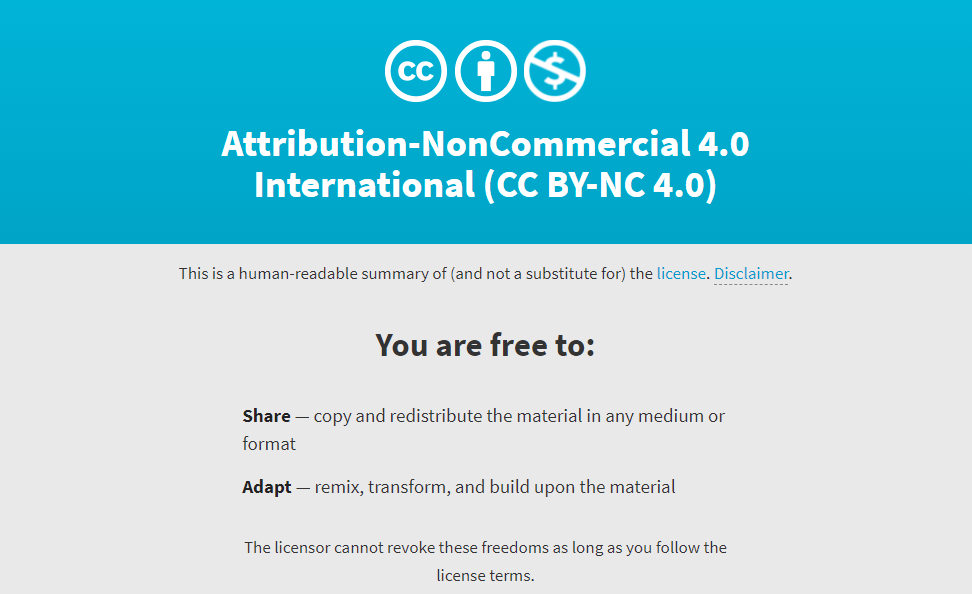

# Snapmaker Stiffy Kit by CTZcnc

The Stiffy Kit is a set of machined or printed parts to add MGN15 rails & MGN15H carriages to the top & bottom of the X module, the left & right sides of the Z modules, and associated brackets to join each module together to substantially stiffen up the rigidity of the Snapmaker 2.0 A350, to ultimately increase its CNCing capability.

# BOM
- 4x MGN15 450mm Linear Rail w/ 1x MGN15H Carriage (https://a.co/d/4GWaNjs)
- 2x additional MGN15H Carriages for Z rails (https://a.co/d/9uLGyMj)
- xx M3 x 10mm Socket Head Cap Screws
- xx M4 x 10mm Socket Head Cap Screws
- xx M5 x 16mm Socket Head Cap Screws
- 1/4" (6.35mm) Aluminum Plate for the X & Z Rail Brackets, and Stiffy bracket spacers
- 3/16" (4.78mm) Aluminum Plate for the Stiffy brackets
- 3/8" (9.53mm) Aluminum Plate for the Toolhead Adapter brackets

# NOTES
It is highly recommended you print the "Machined" step files to prototype / fit your rails & brackets to your machine.  I know Snapmakers should be standardized, but I found very slight differences between my machines which needed adjustment,  especially due to variations & tolerances in finished machined parts.  Spacers / shims may be necessary depending on your accuracy.

# TO DO
- Finish & upload a final Printed version
- Adapt <a href="https://www.thingiverse.com/thing:4909694" target="_blank">BluegrassBlaster's</a> cable chain mod to work with the Stiffy Kit
- Design & print a proper toolhead mount for mist coolant

This project is licensed as

